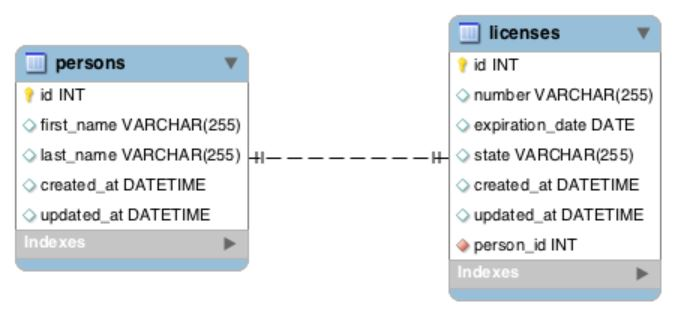
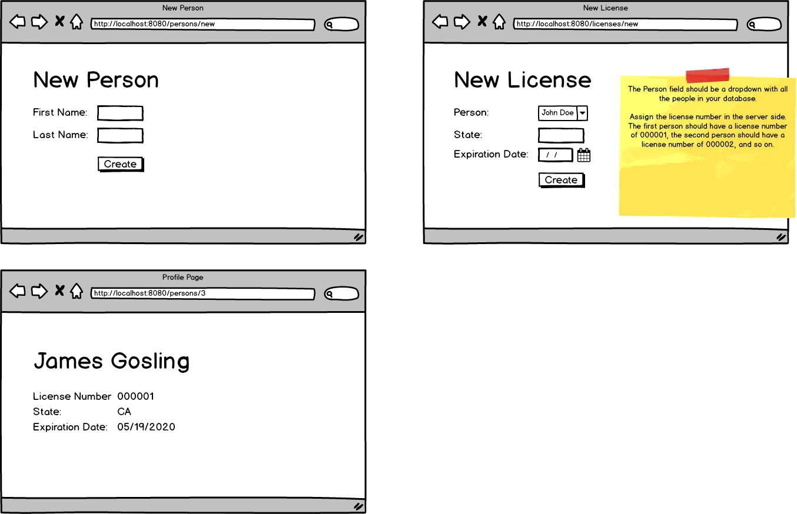
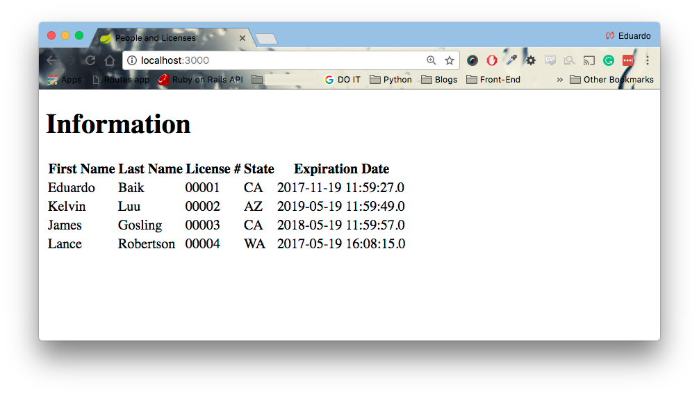

# Java_Driver_License
A Java application that will allow users to create licenses for every person.

Tasks:

● Allow users to create a new person with their first name and last name

● Allow users to create a license with the state and expiration date; however the license number is done by the server. The first person in the DB has a license number of 000001. Increment by 1 every time a new person is added.

● Have a person's show page that will retrieve their name, license number, license state, and license expiration date

ERD and Wireframe

